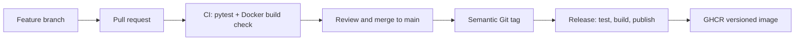

# Student ML API

## Overview

`student-ml-api` is a deliberately small Flask inference service used to demonstrate a production-style MLOps workflow. Its prediction is `value * 2`; the focus is reliable delivery rather than model complexity.

## Architecture / Workflow



## API Endpoints

- `GET /health` returns the application status and release version.
- `POST /predict` accepts `{ "value": 10 }` and returns `{ "input": 10, "prediction": 20 }`.

## Local Setup

```bash
python -m venv .venv
.venv\Scripts\activate
pip install -r requirements.txt
python app.py
```

## Automated Tests

Run `pytest`. The suite covers health, successful prediction, missing input, and invalid input.

## Docker

```bash
docker build -t student-ml-api:1.0.0 .
docker run -d --name student-ml-api -p 5000:5000 student-ml-api:1.0.0
curl http://localhost:5000/health
```

The Dockerfile pins Python, uses a dependency-first layer order, avoids pip cache, exposes port 5000, and runs the application as its explicit command.

## Git Workflow

Features are developed on feature branches and reach `main` only via Pull Requests. The selected merge strategy and branch-protection settings are documented in `docs/IMPLEMENTATION_EVIDENCE.md` after being applied.

## Pull Request Process

Each PR documents its summary, changes, testing, Docker impact, and review checklist. PR CI must pass before merge.

## CI Workflow

`.github/workflows/ci.yml` runs only for PRs targeting `main`: it installs dependencies, runs `pytest`, and validates a Docker build. It does not authenticate to or push to a registry.

## Release Workflow

`.github/workflows/release.yml` runs only for semantic `v*.*.*` tags. It derives the release number from the tag, tests, builds, authenticates to GHCR using `GITHUB_TOKEN`, and publishes version, `latest`, and commit-SHA tags.

## Semantic Versioning

`VERSION` represents the source release. Git tags use the `v` prefix (for example, `v1.0.0`) while container tags omit it (`1.0.0`).

## Container Registry

The release workflow publishes to `ghcr.io/cheemaboi/student-ml-api`. Actual registry evidence and digests are recorded only after a successful release.

## Image Tags

Formal releases receive immutable semantic tags, `latest`, and the short source-commit SHA. `latest` is convenient but insufficient for reproducibility; a commit tag links source and artifact precisely.

## Branch Protection

`main` is configured to require a Pull Request and passing CI. The observed configuration is documented in the evidence file.

## Merge Strategy

Merge commits are used so the feature-branch context remains visible for the assignment audit.

## Artifact Reproducibility

The release artifact is pulled from GHCR and run without rebuilding source. Results are recorded in the evidence file.

## Rollback

Rollback pulls and runs a known-good immutable `1.0.0` image; it does not clone source or rebuild. This avoids dependency drift and restores an already-tested artifact.

## Traceability

`docs/TRACEABILITY.md` connects the actual v1.1.0 PR, merge commit, tag, image tag, and digest.

## OCI Metadata

The release build injects standard OCI version, revision, source, and creation-date labels from GitHub context. Local builds may leave these build arguments blank unless supplied.

## Docker Layer Caching

Dependencies are copied and installed before application code. Consequently an `app.py`-only change can reuse dependency layers, while a `requirements.txt` change intentionally invalidates them. Actual experiment output is documented in the evidence file.

## Failure Analysis

Two deliberate, restored failures are documented in `docs/FAILURE_ANALYSIS.md`.

## Repository Structure

```
app.py  requirements.txt  Dockerfile  VERSION
tests/test_app.py
.github/workflows/{ci.yml,release.yml}
docs/{IMPLEMENTATION_EVIDENCE.md,FAILURE_ANALYSIS.md,TRACEABILITY.md,screenshots/}
```

## Submission Evidence

See `docs/IMPLEMENTATION_EVIDENCE.md` and `docs/screenshots/README.md`.
