# Assignment No. 1 Report - Student ML API

## Student and Repository Details

- Student: Hamza Farooq
- Roll Number: 22i-0912
- GitHub username: Cheemaboi
- Repository: https://github.com/Cheemaboi/student-ml-api
- Main branch: `main`

## 1. Application

I developed a small Flask API called `student-ml-api`. It provides a health endpoint and a prediction endpoint. The prediction logic is intentionally simple: the submitted numeric value is multiplied by two.

- `GET /health` returns application status and version information.
- `POST /predict` accepts a numeric `value` and returns the input and prediction.
- The project contains four pytest tests for health, valid prediction, missing input, and invalid input.

## 2. Git and Pull Request Workflow

Development was completed through feature branches. The first feature branch added the application and tests. The second feature branch added application and model metadata for version 1.1.0. Both changes were merged using merge commits after CI passed.

### Pull Request 1

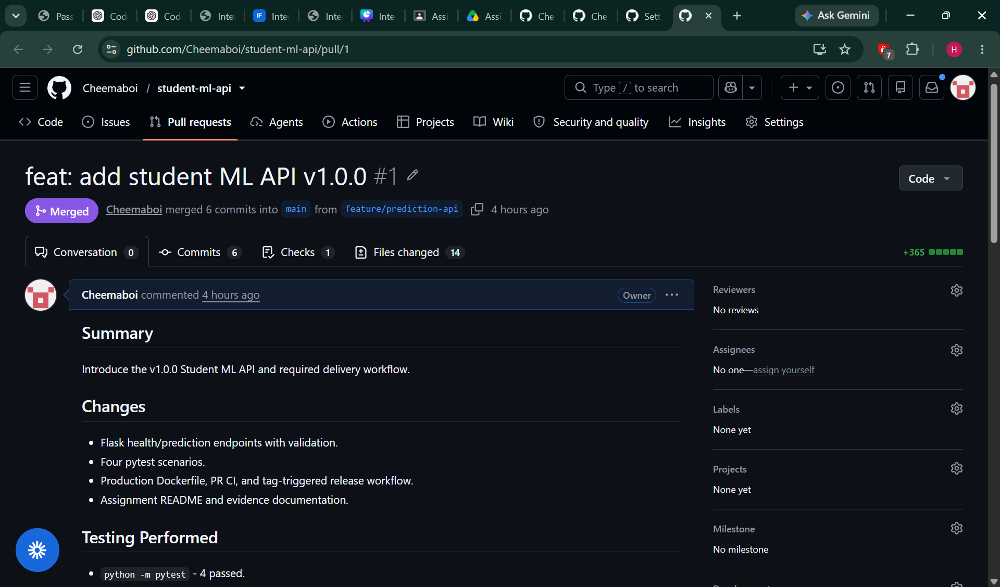

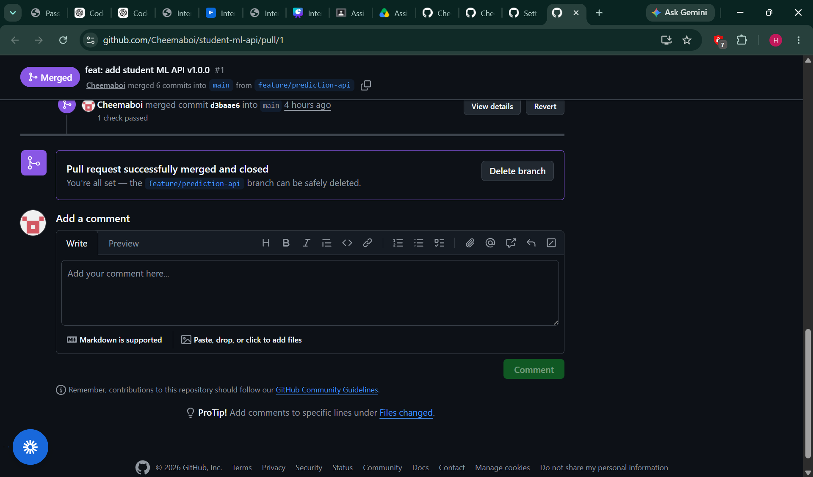

### Pull Request 2

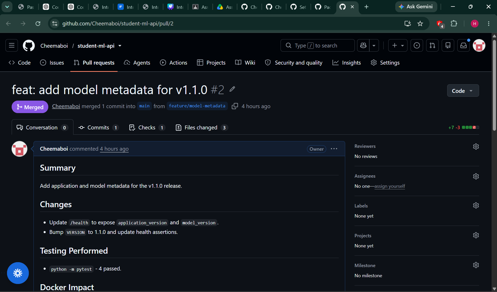

## 3. CI Validation

The CI workflow runs on Pull Requests to `main`. It installs Python dependencies, runs pytest, and validates that the Docker image builds. It does not push images to the registry.

To demonstrate CI failure, I intentionally used an incorrect health-test assertion. The failed run was preserved, then the assertion was corrected and CI passed.

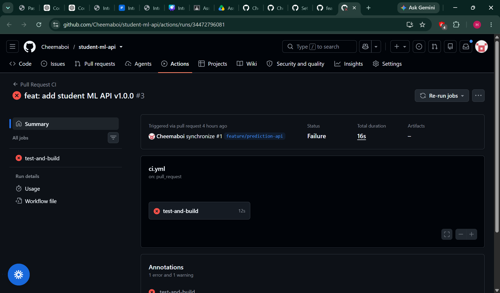

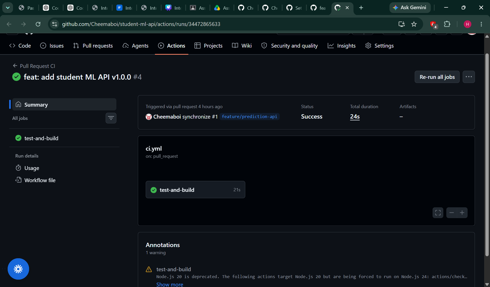

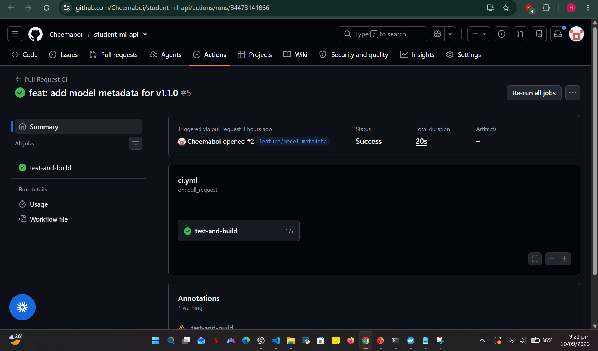

## 4. Branch Protection

The `Protect main` ruleset is active. This protects the main branch and supports the Pull Request workflow.

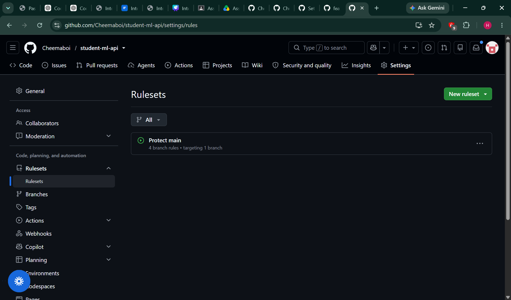

## 5. Docker Container

The Dockerfile uses a fixed Python image version, installs requirements before application code for better caching, exposes port 5000, and runs the API with Gunicorn. The application was built and run in Docker, then tested using `/health` and `/predict`.

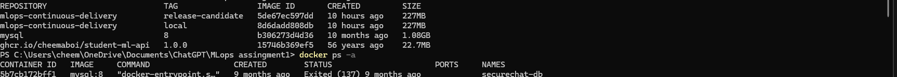

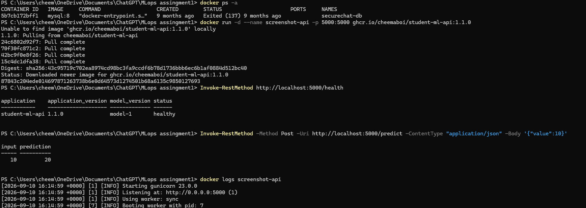

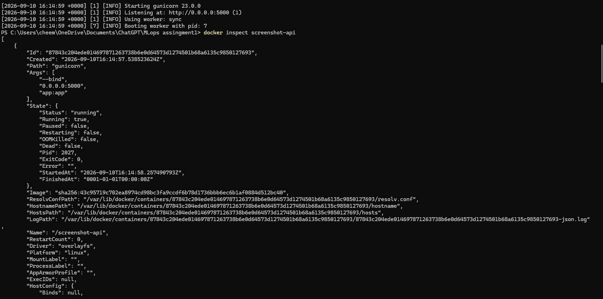

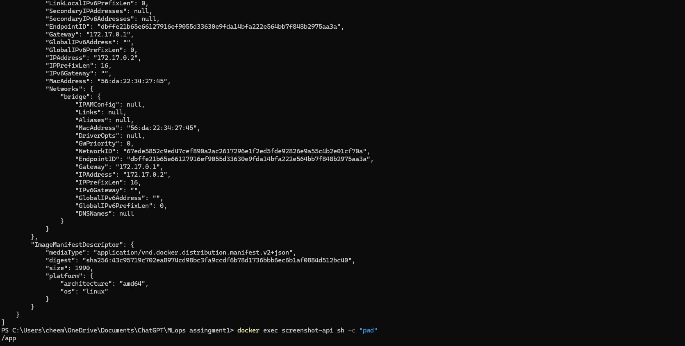

## 6. Releases and Container Registry

The release workflow runs only when a semantic Git tag is pushed. It runs tests, builds the image, logs in to GitHub Container Registry using GitHub Actions credentials, and publishes the image tags.

The repository contains the Git tags `v1.0.0` and `v1.1.0`. GHCR contains `1.0.0`, `1.1.0`, `latest`, and commit-SHA tags.

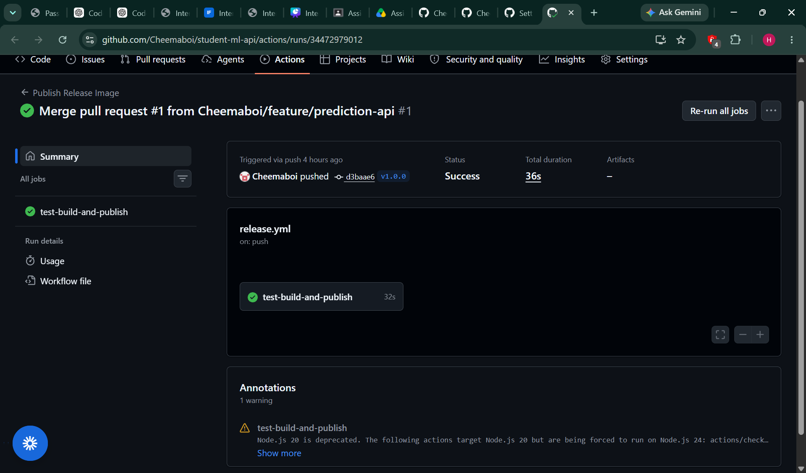

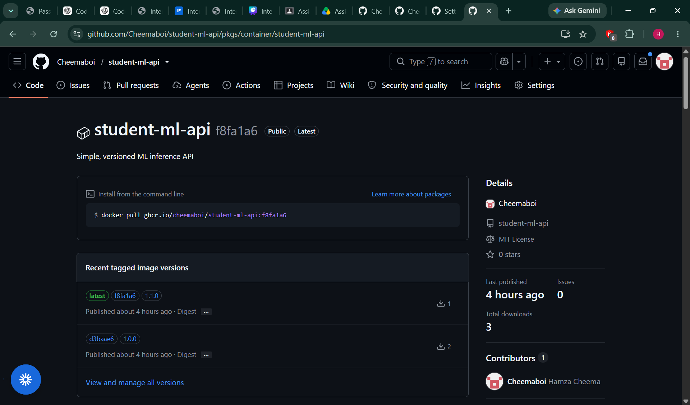

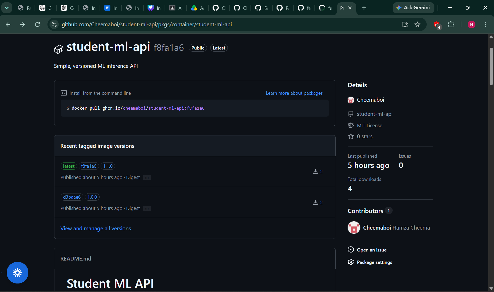

The v1.1.0 image digest is:

`sha256:43c95719c702ea8974cd98bc3fa9ccdf6b78d1736bbb6ec6b1af0884d512bc40`

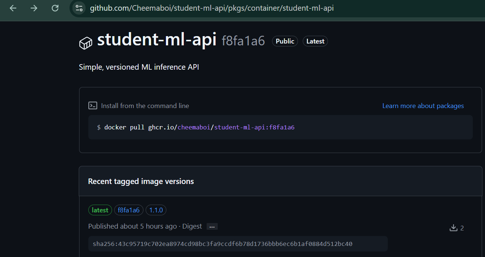

## 7. Traceability

The v1.1.0 release can be traced from PR #2 to its merge commit, Git tag, Docker image tag, and registry digest.

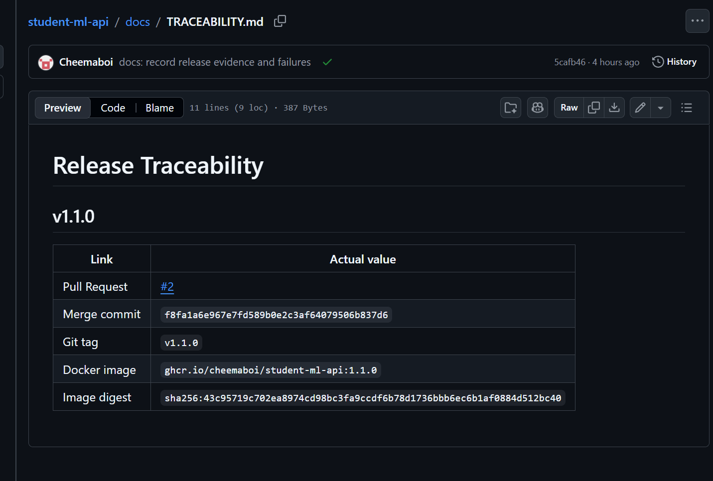

## 8. Rollback and Reproducibility

I pulled the existing `1.0.0` image from GHCR and ran it without rebuilding the source code. The health endpoint returned version 1.0.0. This demonstrates artifact-based rollback to a known-good release.

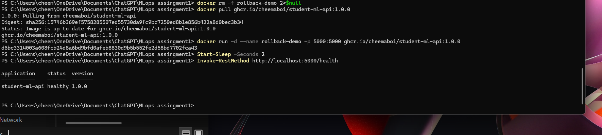

## 9. Failure Analysis

Two failures were documented:

1. An intentionally incorrect health assertion caused CI to fail. It was corrected and CI passed.
2. The initial CI configuration did not include the project root in Python's import path. Adding `PYTHONPATH=.` fixed test collection.

More detail is available in [FAILURE_ANALYSIS.md](FAILURE_ANALYSIS.md).

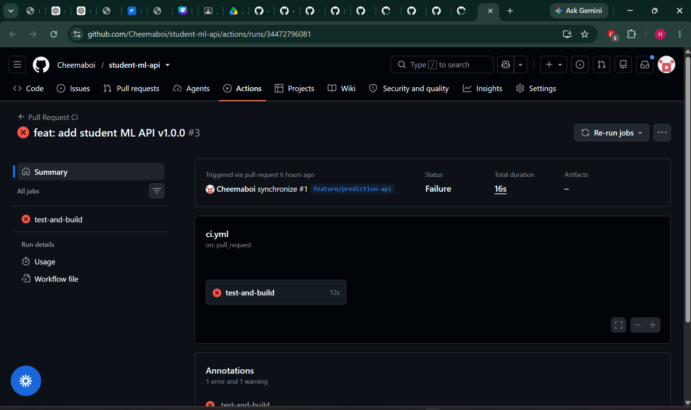

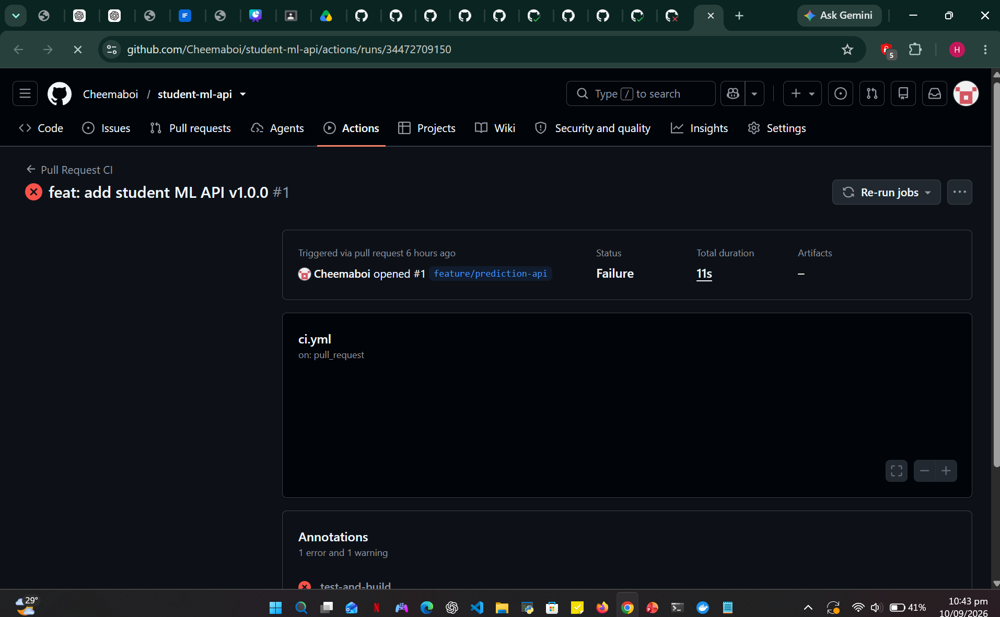

## 10. Advanced Challenges

The release image includes OCI metadata labels for the version, source revision, source repository, and build date. The release workflow also publishes short commit-SHA tags alongside semantic version tags.

For Docker caching, a local experiment showed that changing only `app.py` reused the dependency installation layer. A temporary `requirements.txt` change caused Docker to rerun dependency installation. The temporary changes were removed after the experiment.

Further details are available in [ADVANCED_CHALLENGES.md](ADVANCED_CHALLENGES.md).

## Conclusion

This assignment demonstrates a complete MLOps workflow: feature branches, Pull Requests, CI validation, Docker containerization, semantic version tags, automated GHCR publishing, artifact traceability, and rollback using a previously published image.
